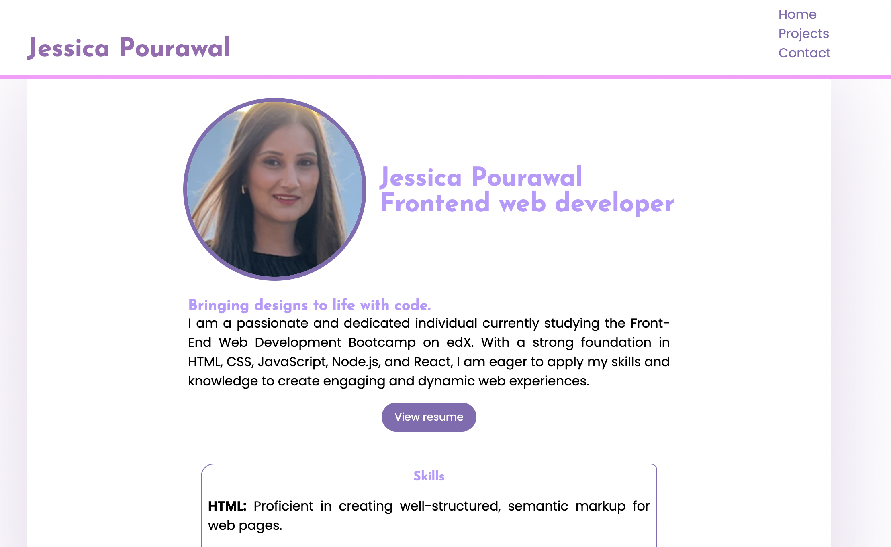

# My Porfolio

## Description

My portfolio website serves as a showcase of my skills, projects, work experience, and education. It provides visitors with a comprehensive overview of my background and expertise in software development.

Features
Responsive Design: The website is designed to be responsive and compatible with various devices and screen sizes.
Multiple Sections: The website includes sections such as About Me, Skills, Projects, Experience, Education, and Contact, allowing visitors to easily navigate and explore different aspects of my portfolio.
Project Showcase: The Projects section showcases some of my notable projects, including descriptions, technologies used, and links to live demos or GitHub repositories.
Contact Form: The Contact section includes a contact form that visitors can use to reach out to me directly.

## Screenshot

## Deployment

[Click here](https://module-13-react-portfolio.onrender.com/)
